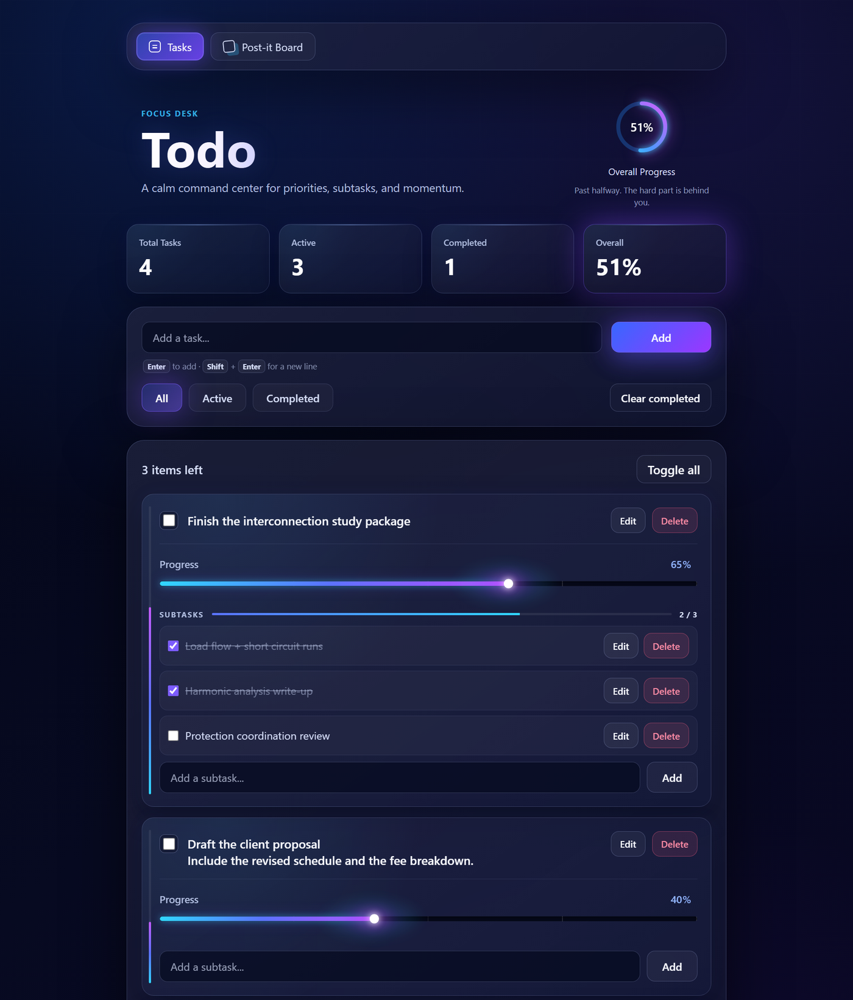
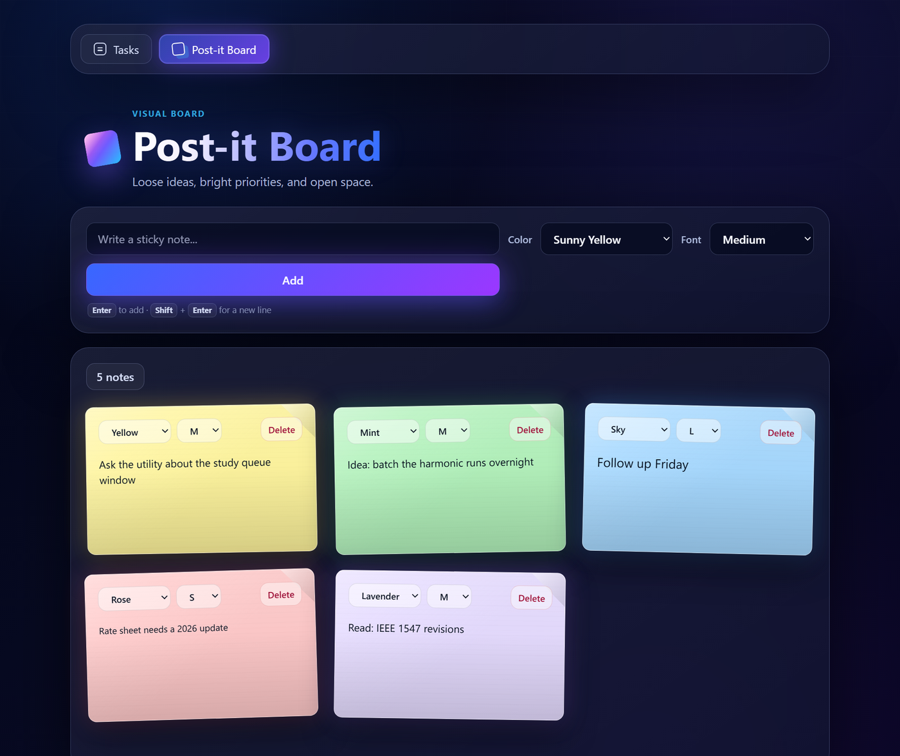

<div align="center">

# Todo — Focus Desk

**A calm, single-page command center for priorities, subtasks, and momentum — plus a sticky-note board for everything that isn't a task yet.**

No frameworks. No build step. No accounts. Open the file and start typing.


</div>

---

## What this is

Most todo apps make you log in, sync, and then guilt you. This one is three static files you can
double-click. It keeps everything in your browser's `localStorage`, and it is built around one idea:
**a task is rarely done or not-done — it's usually somewhere in between.**

So every task carries a real **0–100% progress value**, and the app rolls those up into a single
"Overall Progress" orb at the top, with a short note that changes as you climb:

> *"Start anywhere. The first step is the whole trick."* → *"Past halfway. The hard part is behind you."* → *"All clear. Beautiful work."*

It ships with two pages:

| Page | What it's for |
| --- | --- |
| **Tasks** (`index.html`) | Structured work: progress, subtasks, filters, reordering |
| **Post-it Board** (`board.html`) | Unstructured thinking: colored sticky notes you can drag around |

---

## Screenshots

### Tasks



### Post-it Board



---

## Features

### Tasks page

- **Percent progress per task** — drag the slider, or click the number and type it. `↑` / `↓` nudge by 1,
  `Shift` + `↑` / `↓` by 10, `Esc` reverts.
- **Overall progress orb** — the average progress across all tasks, as an animated gradient ring, with a
  momentum line that reacts to where you are.
- **Live stat cards** — Total / Active / Completed / Overall, counting up smoothly when they change.
- **Subtasks** — each task has its own checklist with a `2 / 3` counter and its own mini progress bar.
  Subtasks are independently checkable, draggable, and editable.
- **Multi-line text** — `Enter` adds the task, `Shift` + `Enter` starts a new line. Inputs grow as you type.
- **Inline editing** — double-click any task or subtask (or hit **Edit**). `Enter` saves, `Esc` cancels.
- **Filters** — All / Active / Completed.
- **Drag to reorder** — tasks and subtasks. (Reordering is enabled on the **All** filter, where the order
  you see is the order that gets stored.)
- **Toggle all** — completes everything and pushes it to 100%; press again to clear it back to 0%.
- **Clear completed** — sweeps finished tasks out in one click.
- **Completion flourish** — hitting 100% plays a short celebration on the card and pulses the orb.

### Post-it Board

- **Colored notes** — Sunny Yellow, Peach, Mint, Sky, Rose, Lavender.
- **Four font sizes** — S / M / L / XL, per note, changeable after the fact.
- **Drag to rearrange** the board.
- **Double-click a note** to edit it in place.
- **Live note count**, and an empty state that tells you what to do.

### Throughout

- Dark, glassy UI with gradient accents — designed to be pleasant to sit in front of.
- Keyboard-first: every primary action has a shortcut, and hints are printed right under the inputs.
- Accessible markup: ARIA labels, `aria-live` regions for counts, screen-reader-only labels, real
  `<label>` / `<kbd>` semantics.
- Respects `prefers-reduced-motion` — the count-up and progress animations turn themselves off.
- Text is normalized on save (line endings, trailing spaces, runs of blank lines), so stored data stays tidy.

---

## Getting started

**The short way** — clone or download, then open `index.html` in your browser. That's it.

```bash
git clone https://github.com/zmntushar/todo-app.git
cd todo-app
```

**Serving it locally** (nicer URLs, and what you'll want if you tinker):

```bash
python -m http.server 4173
```

Then visit <http://localhost:4173>.

There is nothing to install and nothing to build — the whole app is HTML, CSS, and three `<script>` tags.

---

## Keyboard shortcuts

| Where | Key | Does |
| --- | --- | --- |
| Task / subtask / note input | `Enter` | Add it |
| Task / subtask / note input | `Shift` + `Enter` | New line |
| Editing an item | `Enter` | Save |
| Editing an item | `Esc` | Cancel |
| Any task or note | Double-click | Edit in place |
| Progress number field | `↑` / `↓` | ±1% |
| Progress number field | `Shift` + `↑` / `↓` | ±10% |
| Progress number field | `Enter` | Commit |
| Progress number field | `Esc` | Revert to the saved value |

---

## Where your data lives

Everything stays on your machine, in `localStorage`, under two keys:

| Key | Holds |
| --- | --- |
| `todo_app_items_v1` | Tasks, progress values, and subtasks |
| `todo_postit_board_v1` | Sticky notes, colors, and font sizes |

Nothing is sent anywhere — there is no server, no analytics, and no network call in the codebase.

The stored shapes are plain JSON, so you can back them up or edit them by hand from the browser console:

```jsonc
// todo_app_items_v1
[
  {
    "id": "a1b2c3",
    "text": "Finish the interconnection study package",
    "completed": false,
    "createdAt": 1758700000000,
    "progress": 65,
    "subtasks": [
      { "id": "s1", "text": "Load flow + short circuit runs", "completed": true }
    ]
  }
]

// todo_postit_board_v1
[
  {
    "id": "n1",
    "text": "Ask the utility about the study queue window",
    "color": "#fff59d",
    "size": 15,
    "createdAt": 1758700000000
  }
]
```

> **Heads up:** because storage is per-origin, notes you create at `file://` won't show up at
> `http://localhost:4173`, and clearing site data clears your tasks. Export the two keys if they matter.

---

## Project structure

```
todo_app/
├── index.html    # Tasks page — markup plus the <template> for a task card
├── board.html    # Post-it Board page — markup plus the <template> for a note
├── app.js        # Tasks: state, rendering, progress, subtasks, drag & drop, persistence
├── board.js      # Board: notes, colors, sizes, inline editing, drag & drop, persistence
├── style.css     # The whole design system — gradients, glass, animations, both pages
└── docs/         # README screenshots
```

Both scripts follow the same small pattern: an in-memory array is the single source of truth, every
mutation calls `persist()` then `render()`, and rendering clones a `<template>` from the HTML. There is
no virtual DOM and no state library — just an array, `localStorage`, and a render function.

---

## Deploying

It's a static site, so **GitHub Pages** works with no configuration:

1. **Settings → Pages**
2. **Source:** Deploy from a branch
3. **Branch:** `main`, folder `/ (root)` → **Save**

Your app will be live at `https://<username>.github.io/todo-app/`. Netlify, Vercel, Cloudflare Pages, or
any static host will take it as-is too.

---

## Browser support

Any current version of Chrome, Edge, Firefox, or Safari. The app uses `crypto.randomUUID()` where it's
available and falls back gracefully where it isn't.

---

## Contributing

Issues and pull requests are welcome. Because there's no build pipeline, testing a change is just:
edit the file, reload the page.
